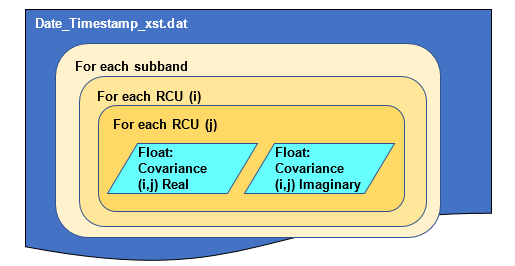

**ACC Source data\
Version 0.0\
14ᵗʰ February 2018\
Oisin Creaner**

This describes the formats for output from LOFAR station's Array
Covariance Cube (ACC) calibration files in its current state.

**Outline**

ACC files contain a matrix of complex numbers describing the Array
Covariances (also known as "crosslets" or "visibilities") between each
of the Receiver Units (RCUs.) This matrix is stored as a series of
binary floating point numbers, alternating real and imaginary components
of the covariance. Therefore, given *n* RCUs, these matrices consist of
2*n*² floating point elements. One such matrix of Array Covariances is
stored for each subband in order. \[1\] Therefore, given *N* subbands,
the total file consists of 2*Nn*² floats. The files in this case
consist wholly of the binary floats, with no header or other metadata
stored.

For a LOFAR international station, the Low Band Antenna array (LBA)
consists of 96 antennae. Two RCUs are connected to each, one for for the
X- and one for the Y-polarisation, giving a total of 192. These are
numbered alternating between X- and Y-polarisation, with the even
numbers (0-190) used for X-polarisation, and odd-numbers (1-191) for
Y-polarisation.

The signal from these RCUs is processed into 512 subbands, each of width
200MHz/1024.

The ACC file records the covariance of each RCU with each other RCU for
each subband into a matrix.  The diagonal of this matrix is thus the variance of the signal from each RCU

**Figure 1: Structure of an ACC file**

Each file is structured thus

-   For each of the 512 subbands

    -   1 covariance matrix.

    -   Each covariance matrix is structured as

    -   For each of the 192 RCUs (Alternating X and Y polarisation)

        -   A row consisting of the covariance for each RCU against each
            other

        -   For each of those 192 covariances, the components are stored
            as

            -   Float: Real component of covariance

            -   Float: Imaginary component of covariance

References
==========
\[1\] I. I. Virtanen, Station Data Cookbook, ASTRON, 2012. 
