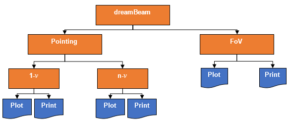
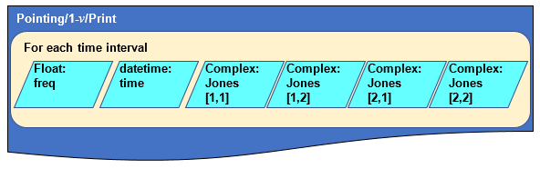
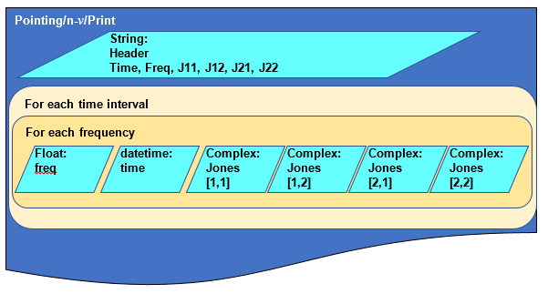
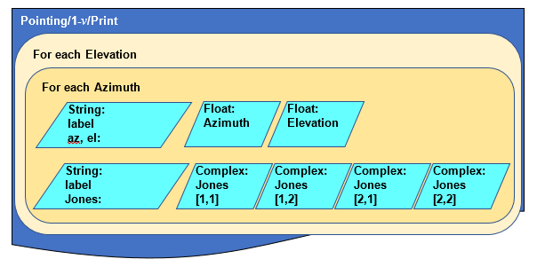

**DreamBeam Source data\
Version 0.0\
8^th^ February 2018\
Oisin Creaner**

This describes the formats for output from DreamBeam in its current
state

**Abstract**

Output from dreamBeam works in two main modes: Pointing and FoV. These
modes produce data that describes the Jones matrix elements for two
different operational requirements. Both modes provide options for
plotting this data visually or outputting it to std.out, This output can
then be redirected to a file if needed.

Pointing mode defines the Jones matrix elements for a given target based
on its celestial coordinates and calculates how these change over a user
defined period in user defined intervals. Optionally, this mode may
calculate the Jones matrix elements for a single user-defined frequency,
or for a variety of frequencies across the bandwidth of the telescope if
the user does not supply a frequency.

FoV mode defines the Jones matrix elements for the whole sky at a given
instant for a given frequency.

**Outline of Modes**

Figure 1: Outline of modes

**Details of Outputs**

1.  Pointing Mode\
    Pointing Mode plots the light curves as observed from a given
    station in a given band over a given time period at a given set of
    intervals. Frequency is an optional parameter which allows a user to
    either specify a frequency to work at (1-*ν*, below) or to require
    that the system calculate the Jones Matrices for all frequencies in
    the system. (n-*ν*, below)

    1.  1-*ν*\
        In this mode, the light-curve in Jones matrix terms is
        calculated for a single frequency over time

        1.  Print\
            The print output for this mode consists of a row for each
            time interval, with each row consisting of the following
            elements, separated by spaces. *Note: this mode does not
            include a header.*

            -   Frequency (print-formatted Python float)

            -   Time (print-formatted Python datetime *YYYY-MM-DD
                HH:MM:SS*)

            -   Four Jones Matrix elements (print-formatted Python
                complex numbers using the notation (*X.xxxx*+*Y.yyyy*j)
                in the order

                -   \[1,1\]

                -   \[1,2\]

                -   \[2,1\]

                -   \[2,2\]

Figure 2: Schematic of Print output for single-frequency use of Pointing
mode

**Sample Output**

**60000000.0 2012-04-01 01:02:03 (-0.0376926375124+0.0467493608816j)
(-0.559791351791+0.0899978276011j) (0.738602661591-0.196422717245j)
(0.159103880251-0.0775363649726j)**

**60000000.0 2012-04-01 01:02:04 (-0.0376395582277+0.0467382172651j)
(-0.55979972323+0.0899965320884j) (0.738611482535-0.196421498181j)
(0.159158232172-0.0775483040615j)**

**60000000.0 2012-04-01 01:02:05 (-0.0375864775634+0.0467270738462j)
(-0.559808091231+0.0899952354983j) (0.738620299442-0.196420277746j)
(0.159212585231-0.0775602427118j)**

**60000000.0 2012-04-01 01:02:06 (-0.0375333955529+0.0467159306318j)
(-0.559816455789+0.0899939378314j) (0.738629112309-0.196419055939j)
(0.159266939393-0.0775721809157j) **

2.  Plot\
    The plot mode produces an image of the trajectory of the selected
    pointing and a set of plots of the light curves for that object at
    the given frequency over the given interval

    The trajectory plot (as shown in Figure 3) shows the apparent
    position of the object at each point in time. *Note: In LOFAR, for a
    non-core station, these coordinates will not be centred on the pole
    as the orientation is set for the LOFAR core -- Check details of how
    that works -- OC *

Figure 3: Sample of plot output of the track of the coordinates of the
target object for pointing mode

> The Light curve plot displays the p-channel
> $\left( p = \left| {J\left\lbrack 1,1 \right\rbrack}^{2} \right| + \left| {J\left\lbrack 1,2 \right\rbrack}^{2} \right| \right)$
> and q-channel
> $\left( q = \left| {J\left\lbrack 2,1 \right\rbrack}^{2} \right| + \left| {J\left\lbrack 2,2 \right\rbrack}^{2} \right| \right)$
> calculated for each point in time against time for the given
> frequency. *Note: Want to check the implications of these two channels
> -- OC*

Figure 4: Sample of Plot output for lightcurve for a single frequency in
pointing mode. Time is plotted on the x-axis, p- and q-channel values
are plotted on the y-axis.

2.  n-*ν\
    *In this mode, the light-curve in Jones matrix terms is calculated
    for a number of (*all possible? -- to check*) frequencies over time

    3.  Print\
        The print output for this mode consists of a row for each time
        interval/frequency combination, with a header to describe the
        columns. Each row consists of the following elements, separated
        by spaces

        -   Time (print-formatted Python datetime
            *YYYY-MM-DD*T*HH:MM:SS*)

        -   Frequency (print-formatted Python float)

        -   Four Jones Matrix elements (print-formatted Python complex
            numbers using the notation (X.xxxx+Y.yyyyj) in the order

            -   \[1,1\]

            -   \[1,2\]

            -   \[2,1\]

            -   \[2,2\]

Figure 5: Schematic of Print output for multi-frequency use of Pointing
mode

Sample Output

Time, Freq, J11, J12, J21, J22

2018-02-06T14:00:00 100000000.0 (0.66341703593+3.81594230048e-05j)
(0.734230798413+4.67556454144e-05j) (-0.728670398582-0.000157718454146j)
(0.657853576392+0.000149924324324j)

2018-02-06T14:00:00 100195312.5 (0.663422817909+3.78016297019e-05j)
(0.734237231341+4.63214173956e-05j) (-0.728672812056-0.000156021203443j)
(0.657855732724+0.000148292112886j)

2018-02-06T14:00:00 100390625.0 (0.663428623131+3.74508255174e-05j)
(0.734243690078+4.58952493196e-05j) (-0.728675253667-0.000154346887646j)
(0.657857914921+0.000146681668139j)

1.  Plot\
    The plot mode produces an image of the trajectory of the selected
    pointing and a set of plots of the light curves for that object at
    the given frequency over the given interval

    The trajectory plot (as shown in Figure 3) shows the apparent
    position of the object at each point in time. *Note: In LOFAR, for a
    non-core station, these coordinates will not be centred on the pole
    as the orientation is set for the LOFAR core -- Check details of how
    that works -- OC *

Figure 6: Sample of plot output of the track of the coordinates of the
target object for pointing mode for n-frequencies

> The Light curve plot displays the p-channel
> $\left( p = \left| {J\left\lbrack 1,1 \right\rbrack}^{2} \right| + \left| {J\left\lbrack 1,2 \right\rbrack}^{2} \right| \right)$
> and q-channel
> $\left( q = \left| {J\left\lbrack 2,1 \right\rbrack}^{2} \right| + \left| {J\left\lbrack 2,2 \right\rbrack}^{2} \right| \right)$
> values calculated for each point in time against time for each
> frequency. The plot then shows the values in colour, with the time and
> frequency as x- and y-axes respectively

Figure 7: Sample of Plot output for lightcurve for multiple frequency in
pointing mode (*query to raise: Should HBA and LBA output in this mode
be identical?*) Time is plotted on the x-axis, frequency on the y-axis,
p- and q-channel values are plotted on the z-axis (colour).

1.  FoV Mode

    1.  Print

        The print output for this mode consists of a pair of rows for
        each time interval, with each alternating row consisting of the
        following elements, separated by spaces. *Note: this mode
        produces output with labels for each row.*

        -   First Row

            -   Label (az, el: )

            -   Azimuth (print-formatted Python float)

            -   Elevation (print-formatted Python float) (*Why not
                Altitude? - OC*)

        -   Alternate Rows

            -   Label (Jones: )

            -   Four Jones Matrix elements (print-formatted Python
                complex numbers using the notation (*X.xxxx*+*Y.yyyy*j)
                in the order

                -   \[1,1\]

                -   \[1,2\]

                -   \[2,1\]

                -   \[2,2\]

Figure 8: Schematic of Print output for single-frequency use of Pointing
mode

Sample Output (*Query -- these values include negative elevations -- how
come?* *Some of these seem to show different Jones values at different
RA (?) values at DEC 90. Isn't this a constant point?*)

az, el: 0.0 1.57079632679

Jones: (0.808438378389-0.0536168902205j)
(-0.174461109928-0.0550466007067j) (0.176809726227-0.0764445107476j)
(0.810303656386-0.044823755958j)

az, el: 0.0245436926062 1.57079632679

Jones: (0.803911684752-0.0549513922064j)
(-0.19424874567-0.0537143676432j) (0.196640074711-0.0775212195077j)
(0.80572271751-0.0429343667736j)

2.  Plot

    The Light curve plot for FoV Mode plots the I, q, u and v parameters
    as colour against RA and DEC.\
    *To be completed -- I'm not sure on how RA and DEC are calculated
    from Altitude and Azimuth (which seem to be the parameters that are
    used., at least in the docs)*

Figure 9: Sample of plot output for FoV mode. In each plot, RA is used as
the x-axis, and DEC as the y-axis. The Stokes parameters, calculated
from the Jones Matrices, are plotted on the z-axis (colour)
