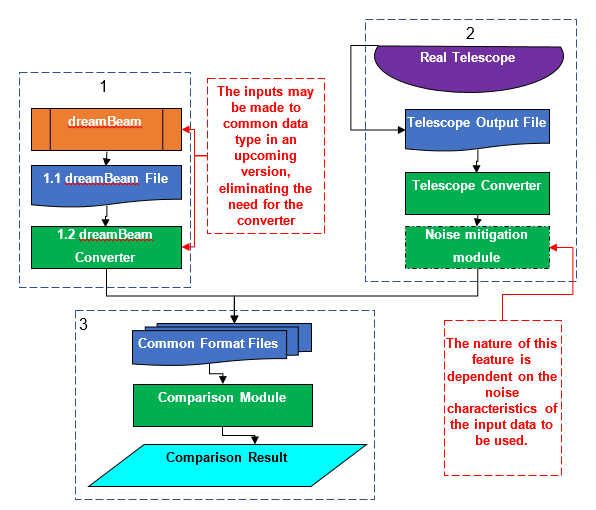

**Testing harness\
Version 0.2\
22ⁿᵈ February 2018\
Oisin Creaner**

This system is designed to provide a comparison between the output for
models of telescope performance vs calibration data from real telescopes

**Abstract**

The output from the model and from the real observation are extracted
from their respective source formats and converted into a common format if needed.
Once in this common format, the two datasets are compared by means of a
modular comparison system to produce an output which provides one or more figures
of merit regarding the fit of the model to the real data.

**Design diagram**

**Figure 1: Design of the testing harness system**

**Operation**

1.  Data is provided by the predefined DreamBeam system and converted to
    a common format

    1.  DreamBeam data is currently stored in proprietary format(s)
        described in [this data description document](DreamBeam_Source_data_description.md)

    2.  This is converted by a process defined in (*to be developed – may be modified output from Dreambeam*) into
        the common format for comparison between instrument and model
        data (*probably CSV*)

        1.	Further manipulations may be carried out as an optional feature.

2.  Data from a telescope is converted from its current format to a
    suitable common format

    1.  Data is provided by telescopes in proprietary format(s)
        described in [this data description document](ACC_CSV_converter/ACC_Source_data_description_0_0.md) (*ACC files do not dovetail well with DreamBeam outputs – need to consult with TCD to discuss most suitable inputs*)

    2.  This is converted by a process similar to that described in [this software design document](ACC_CSV_converter/ACC_to_CSV_converter_0_0.md) such as  [this python script](ACC_CSV_converter/ACC_CSV_Converter.py) into
        the common format for comparison between instrument and model
        data (*probably CSV*)

    3.  *Future Feature*: It is necessary to put a moving average or some other smoothing here to reduce the impact of scintillation and other sources of noise, as these will attribute errors to the model which are caused by factors other than the model.
3.  Data in the common format is compared between model and test, and an
    evaluation of the accuracy, error and other comparisons between the
    two datasets is carried out.

    1.  Data in the common dataset (*currently CSV*)

    2.  A module similar to that described in [this software design document](comparison_module/Comparison_Module.md) such as [this R script](comparison_module/prototype_comparison_module_1d_0_0.r) compares the data from real and model: calculating the difference, correlation, and RMSE (*this can be extended*) to define a figure of merit 
    3.  *Future Element*:calculate this figure of merit for each value of the independent variables in the parameter space such as
        1.  Model
        2.  Station
        3.  Frequency (or Frequency Band: HBA/LBA)
        4.  Time (of Day or Year)
        5.  Target
    4.  Future element: map the variance of the response of the system by Alt-Azimuth instead of tracking against a single target over time
    5.  Output is produced in a suitable format.Initial elements include:
        1.  PNG File plotting model vs real
        2.  PNG File plotting difference
        3.  Text output of RMSE
        4.  Text output of correlation
    6.  Future element: a plot or series of plots of how the figure of merit varies against independent variables in the parameter space above.
