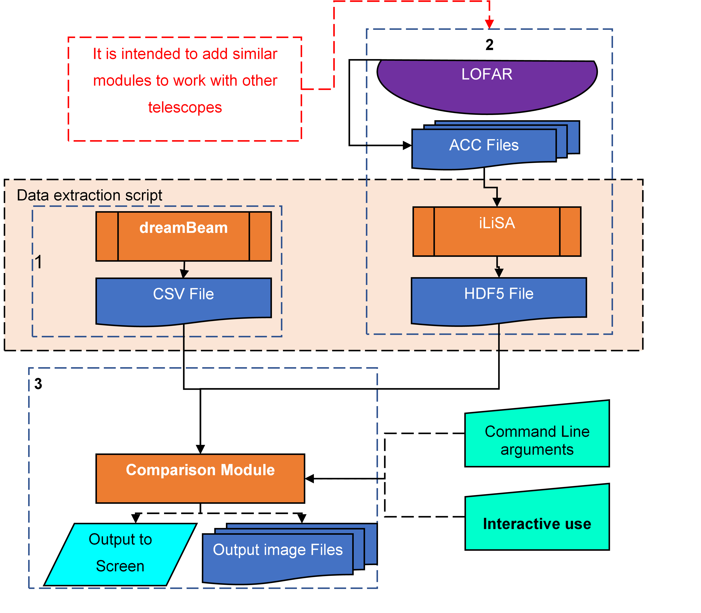

# beamModelTester

beamModel Tester was developed to enable comparison of models of phased array radio telescope data with observations made 
using said telescope to enable evaluation of the model and guide improvements.  In addition, this system enables plotting 
of results from a single station observation on a variety of parameters.

## How to use

### Analysis of existing Data

Save the [two files at this link](https://zenodo.org/record/1744987#.XAEbpdv7SUk) to your computer and 
Run the [comparison module](/comparison_module/comparison_module_1_0.py) 
and input the HDF5 file as the "scope" parameter and the CSV file as the "model."
[Follow the instructions at this link. ](/comparison_module/interactive_mode.md)
Select the plots you wish to generate.  This may be carried out interactively using the menu system or by passing command line arguments
[More complete Documentation on the comparison module may be found here.](/comparison_module/readme.md)

*Non-interactive version*
e.g. ***./comparison_module/comparison_module_1_0.py --model ~/SE607_24h_sim.csv
 --scope ~/SE607_2018-03-16T15_58_25_rcu5_CasA_dur86146_ct20161220_acc2bst.hdf5
 --values xx yy --plots spectra model scope diff -I 0***

*Interactive version*
e.g. ***./comparison_module/comparison_module_1_0.py***

*Command Line Interactive version*
e.g. ***./comparison_module/comparison_module_1_0.py -I 2***

### Full Pipeline Data Processing
Acquire ACC Data from LOFAR and store it in a directory with the following name structure

*{STN_ID}_YYYYMMDD_HHMMSS_rcu{RCU_MODE}_dur{DURATION}_{SOURCE}_acc*\
e.g. *IE613_20180406_091321_rcu3_dur91863_CasA_acc*

A sample of suitable data is available at https://zenodo.org/record/1326532#.W3L8FNVKiUk

Run the [data extraction script](https://github.com/creaneroDIAS/beamWrapper/blob/master/data_wrapper.sh) 
with that directory as an argument.\
e.g ***./beamWrapper/data_wrapper.sh ~/IE613_20180406_091321_rcu3_dur85628_CasA_acc***

This will produce a [HDF5 file](/data_descriptions/OSO_HDF5.md)
and a [CSV file](/data_descriptions/DreamBeam_Source_data_description.md) which can be used in the next step
or otherwise as needed.

## Design Components

There are three major components to this system:
  * Data from the Telescope (Currently LOFAR ACC files converted to HDF5 by [iLiSA](https://github.com/2baOrNot2ba/iLiSA))
  * Data from the Model (Currently Hamaker as output from [dreamBeam](https://github.com/2baOrNot2ba/dreamBeam))
  * Comparison/Analysis
  
Software Design Documents are available at [This Link](/overall_design.md)

  
Extraction of data, especially observed data, can be time-consuming.  As a result, separate scripts are provided to 
[extract the data](https://github.com/creaneroDIAS/beamWrapper/blob/master/data_wrapper.sh) 
and to [analyse it](/comparison_module/comparison_module_1_0.py).
An [overall script](https://github.com/creaneroDIAS/beamWrapper/blob/master/complete_wrapper.sh) 
which calls all three components of the software is provided, but usually the data extraction routines are carried out once, 
but the analysis and visualisations are repeated, so the use of this script is deprecated. *Currently a minor bug in this to be worked out*

## System Requirements

* Python 2.7
  * Python Libraries:
  * Required: pandas, numpy, sys, argparse, os, h5py, matplotlib, scipy
  * Recommended: astropy, casacore

Installed packages
  * [dreamBeam](https://github.com/2baOrNot2ba/dreamBeam)
  * [iLiSA](https://github.com/2baOrNot2ba/iLiSA)

* Recommended OS: Ubuntu 18.04
* Partial functionality available in Windows 8, 10
* Other operating systems not tested, but may work with appropriate Python interpreter.
