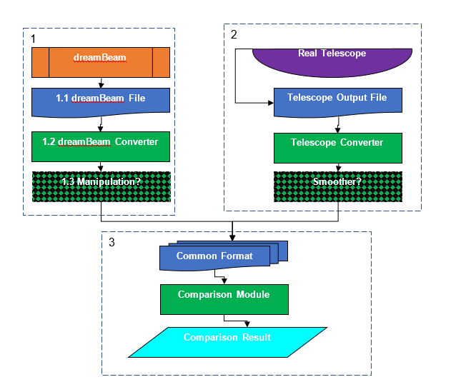

**Testing harness\
Version 0.0\
6^th^ February 2018\
Oisin Creaner**

This system is designed to provide a comparison between the output for
models of telescope performance vs calibration data from real telescopes

**Abstract**

The output from the model and from the real observation are extracted
from their respective source formats and converted into a common format.
Once in this common format, the two datasets are compared by means of a
modular comparison system to produce an output which provides a figure
of merit regarding the fit of the model to the real data.

**Design diagram**

**Operation**

1.  Data is provided by the predefined DreamBeam system and converted to
    a common format

    1.  DreamBeam data is currently stored in proprietary format(s)
        described in (will write up a doc for this)

    2.  This is converted by a process defined in (to be developed) into
        the common format for comparison between instrument and model
        data (to be determined, possibly CASA measurement set)

    3.  OPTIONAL: the converted measurement set may be manipulated in
        appropriate ways (e.g. changing measurement cadence)

2.  Data from a telescope is converted from its current format to a
    suitable common format

    4.  Data is provided by telescopes in proprietary format(s)
        described in (will need to look into the specs on this: probably
        ACC files)

    5.  This is converted by a process defined in (to be developed) into
        the common format for comparison between instrument and model
        data (to be determined, possibly CASA measurement set)

    6.  OPTIONAL: We possibly want to put a moving average or some other
        smoothing here to reduce the impact of scintillation and other
        sources of error other than the model.

3.  Data in the common format is compared between model and test, and an
    evaluation of the accuracy, error and other comparisons between the
    two datasets is carried out.

    7.  Data in the common dataset (to be determined, possibly CASA
        measurement set)

    8.  A module (to be developed) compares the data from real and model
        sources by (to be determined, probably correlation, RMSE etc.)
        to define a figure of merit for each value of the independent
        variables in the parameter space (currently proposed independent
        variables are model, station, frequency and time. Possible
        expansions include target, and some attempt to map by
        Alt-Azimuth instead of tracking against a single target)

    9.  Output is produced in a suitable format (to be determined,
        probably a plot or series of plots of how the figure of merit
        varies against independent variables in the parameter space.)
