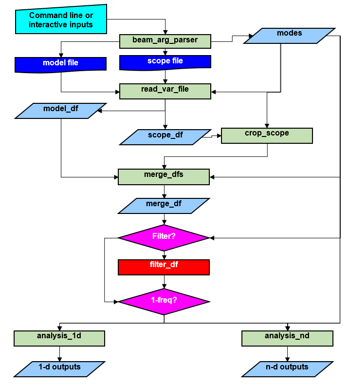

**Comparison Module (*Design*)\
Version 0.3\
23ʳᵈ March 2018\
Oisin Creaner**

This module takes input from a model of telescope performance and
compares it with calibration data from real telescopes to generate
metrics for the deviation of the model from reality

**Dependencies**\
pandas\
numpy\
matplotlib.pyplot\
scipy.stats.stats.pearsonr\
argparse\
h5py

**Assumptions**

1.  Model data and telescope data can be made available
2.  The datasets have common independent variables with which to match
    the datasets
3.  The datasets have a comparable dependent variable (either both have the same 
    actual variable, or variables that can be calculated from those stored in the data.)
4.  Inputs will only be provided in the correct format.

**Inputs**\
a file containing the model data in [dreamBeam csv format](/DreamBeam_Source_data_description.md)

Either:
1.  a file containing model data in dreamBeam csv format to compare models
2.  a file containing scope data in OSO HDF5 format\

Command line arguments specifying the following.  
Detailed inputs available at [this link](/comparison_module/readme.md)
1.  Normalisation mode
2.  Cropping (Type, Basis and Value)
3.  Difference to be employed (subtraction, division, inverse division)
4.  Values to plot (all, linear, stokes, xx, xy, yy, U, V, I, Q)
5.  Options to plot (rmse,corr,value,diff)
6.  Frequency options (single, multiple, file-based)

**Outputs**\
Detailed outputs and links to samples available at [this link](/comparison_module/readme.md).

1.  In [one-frequency mode](/comparison_module/function_docs/analysis_1d.md), the outputs are
    1.  A plot of the values of each of the channels for both model and scope over time
    2.  A plot of the differences between the model and scope for each channel over time
    3.  A calculation of the correlation coefficient between the model
        and the scope data for each channel
    4.  A calculation of the Root Mean Square Error between the model
        and the scope data for each channel

2.  In [multi-frequency mode](/comparison_module/function_docs/analysis_nd.md), the outputs are
    1.  A calculation of the correlation coefficient between the model
        and the scope data for each channel
    2.  A calculation of the Root Mean Square Error between the model
        and the scope data for each channel
    3.  A 3-d colour plot of the differences between the model and scope
        for each channel over time and frequency.  
    4.  A plot of the correlations over time between the model and scope for each channel at each frequency
    5.  A plot of the root mean square error over time between the model and scope for each channel at each frequency        
    6.  A plot of the correlations over time between the model and scope for each channel at each time
    7.  A plot of the root mean square error over time between the model and scope for each channel at each time     

**Outline**

This Python module reads in input from a modelling system and input from a real
telescope and compares the two against one another. This module assumes
that the inputs have been brought to a suitable format (so far dreamBeam CSV 
or OSO HDF5 formats are supported), with common
independent variables (e.g. position, time, frequency) and at least one
common dependent variable to be compared. Outputs include a plot of the
variation of the dependent variable between the "scope" and the "model" files, 
a calculated value of Root
Mean-Square Error (RMSE), and a calculated value for the correlation of
the variables. (*These outputs can be expanded in Future*)

**Design Diagram**

**Figure 1: Outline of the Comparison Module**

**Operation**

1. Parse the command line arguments or user interactive input using 
[beam_arg_parser](/comparison_module/function_docs/arg_parser.md)
2. Read in the data from the model file using the variable reader function 
[read_var_file](/comparison_module/function_docs/file_reading_functions.md)
and store the contents in a dataframe
   
3.  Read in the data from the telescope file using the same variable reader function and store the contents in a
    dataframe

4.  Crops the scope dataframe to eliminate outliers in accordance with the mode settings
5.  Merge the dataframes using an inner join to ensure only data points
    where a common value(s) for the independent variable(s) exists using 
    the flexible dataframe merger function, 
    [merge_dfs](/comparison_module/function_docs/merge_dfs.md)
    1.  (*Option: consider including statistics of this operation in the outputs?*)

    2.  As part of this process, the difference between the two sets of values for the dependent
        variable(s) (either p- and q-channels or xx, xy and yy channels) 
        is calculated and stored as a column in the merged dataframe
6.  Depending on whether the user has specified a frequency filter
    1.  Drop all frequencies from the dataframe except those specified.
7.  Depending on whether there is a single value for frequency or multiple values, 
    the program will perform slightly different analyses.  
    1.  [one-frequency mode](/comparison_module/function_docs/analysis_1d.md) 
    produces outputs suitable for single frequency operations 
    2.  [multi-frequency mode](/comparison_module/function_docs/analysis_nd.md)
        produces outputs suitable for multiple frequency operations 
   

